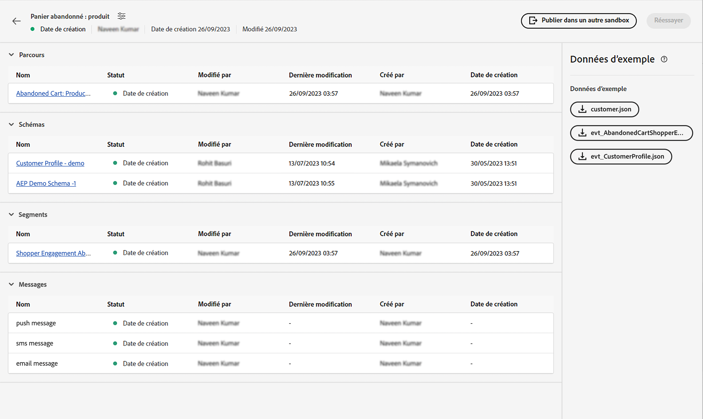

# Événement unitaire

## Procédure à suivre {#steps-to-follow}

>[!CONTEXTUALHELP]
>id="marketerexp_sampledata_unitaryevent"
>title="Comment utiliser ?"
>abstract="Pour plus d’informations, suivez le lien ."

>[!IMPORTANT]
>
>Ces instructions peuvent changer selon les **[!UICONTROL Manuel]** veuillez toujours consulter la section Exemple de données des **[!UICONTROL Manuel]**.

## Condition requise

* Le logiciel Postman doit être installé
* Utilisez Playbook pour créer des ressources d’instances telles que **[!UICONTROL Parcours]**, **[!UICONTROL Schémas]**, **[!UICONTROL Segments]**, **[!UICONTROL Messages]** etc.

Les ressources créées s’affichent sur `Bill Of Material` Page



## Préparation de Postman avec la collection requise

1. Visite **[!UICONTROL Manuel de cas d’utilisation]** application.
1. Cliquez sur les **[!UICONTROL Manuel]** carte à visiter **[!UICONTROL Manuel]** page de détails.
1. Visite **[!UICONTROL Bill de matières]** et recherchez les **[!UICONTROL Exemples de données]** .
1. Téléchargez la `postman.json` en cliquant sur les boutons correspondants de l’interface utilisateur.
1. Importer `postman.json` dans le **[!DNL Postman Software]**.
1. Créez un environnement Postman dédié à cette validation (par exemple, `Adobe <PLAYBOOK_NAME>`).

## Récupération du jeton IMS

>[!NOTE]
>
>Toutes les variables d’environnement sont sensibles à la casse. Vous devez donc toujours utiliser le nom exact de la variable.

1. Veuillez suivre [Authentification et accès aux API Experience Platform](https://experienceleague.adobe.com/docs/experience-platform/landing/platform-apis/api-authentication.html) documentation pour générer le jeton d’accès.
1. Stocker la valeur du jeton d’accès dans les variables d’environnement nommées `ACCESS_TOKEN`.
1. Stocker d’autres valeurs liées à l’authentification comme `API_KEY`, `IMS_ORG` et `SANDBOX_NAME` dans les variables d’environnement.

>[!IMPORTANT]
>
>Avant d’exécuter une API à partir de Postman, assurez-vous que toutes les variables d’environnement requises doivent être ajoutées.

## Publier le Parcours créé par Playbook

Vous pouvez publier le parcours de deux manières différentes :

1. **Utilisation de l’interface utilisateur d’AJO** - cliquez sur le lien Parcours sur `Bill Of Material Page`; vous serez redirigé vers la page de Parcours sur laquelle vous pourrez cliquer. **[!UICONTROL Publier]** et Parcours seront publiés.

   

1. **Utilisation de l’API Postman**

   1. Déclencheur **[!DNL Publish Journey]** de **[!DNL Journey Publish]** > **[!DNL Queue journey publish job]**.
   1. La publication par parcours peut prendre un certain temps. Par conséquent, pour vérifier l’état, exécutez l’API Vérifier l’état de publication par Parcours jusqu’à ce que la fonction `response.status` is `SUCCESS`, veillez à attendre 10 à 15 secondes si la publication par parcours prend du temps.

   >[!NOTE]
   >
   >Toutes les variables d’environnement sont sensibles à la casse. Vous devez donc toujours utiliser le nom exact de la variable.

## Ingestion du profil client

>[!TIP]
>
>Vous pouvez réutiliser la même adresse électronique en ajoutant `+<variable>` dans votre email, par exemple `usertest@email.com` peut être utilisé comme `usertest+v1@email.com` ou `usertest+24jul@email.com`. Il serait utile d’avoir un nouveau profil à chaque fois, tout en utilisant le même ID d’adresse électronique.

1. Le nouvel utilisateur doit créer la variable **[!DNL customer dataset]** et **[!DNL HTTP Streaming Inlet Connection]**.
1. Si vous avez déjà créé la variable **[!DNL customer dataset]** et **[!DNL HTTP Streaming Inlet Connection]**, passez à l’étape `5`.
1. Déclencheur **[!DNL Customer Profile Ingestion]** > **[!DNL Create Customer Profile InletId]** > **[!DNL Create Dataset]** pour créer **[!DNL customer dataset]**; cela stockera une `CustomerProfile_dataset_id` dans les variables d’environnement postman.
1. Créer **[!DNL HTTP Streaming Inlet Connection]**, utilisez les API Postman sous **[!DNL Customer Profile Ingestion > Create Customer Profile InletId]**.

   1. `CustomerProfile_dataset_id` doit être disponible dans les variables d&#39;environnement postman, sinon, reportez-vous à l&#39;étape `3`.
   1. Déclencheur **[!DNL `CREATE Base Connection`]** to [!DNL create base connection].
   1. Déclencheur **[!DNL `CREATE Source Connection`]** to [!DNL create source connection].
   1. Déclencheur **[!DNL `CREATE Target Connection`]** to [!DNL create target connection].
   1. Déclencheur **[!DNL `CREATE Dataflow`]** to [!DNL create dataflow].
   1. Déclencheur **[!DNL `GET Base Connection`]**: stockera automatiquement `CustomerProfile_inlet_id` dans les variables d’environnement postman.

1. À cette étape, vous devez disposer des `CustomerProfile_dataset_id` et `CustomerProfile_inlet_id` dans les variables d’environnement postman ; dans le cas contraire, veuillez vous reporter à l’étape `3` ou `4` respectivement.
1. Pour ingérer un client, l’utilisateur doit stocker `customer_country_code`, `customer_mobile_no`, `customer_first_name`, `customer_last_name` et `email` dans les variables d’environnement postman.

   1. `customer_country_code` serait le code de pays du numéro de mobile, par exemple `91` ou `1`
   1. `customer_mobile_no` serait un numéro de mobile, par exemple : `9987654321`
   1. `customer_first_name` serait le prénom de l’utilisateur.
   1. `customer_last_name` serait le nom de l’utilisateur
   1. `email` correspond à l’adresse électronique de l’utilisateur. Il est essentiel d’utiliser un ID de messagerie distinct afin qu’un nouveau profil puisse être ingéré.

1. Mise à jour de la requête Postman **[!DNL Customer Ingestion]** > **[!DNL Customer Streaming Ingestion]** pour modifier le canal préféré du client ; par défaut [!DNL `email`] est configuré dans la requête.

   ```js
   "consents": {
       "marketing": {
           "preferred": "email",
           "email": {
               "val": "y"
           },
           "push": {
               "val": "n"
           },
           "sms": {
               "val": "n"
           }
       }
   }
   ```

1. Modifier le canal préféré en `sms` ou `push` et définissez la valeur de canal correspondante sur `y` et `n` à d’autres valeurs, par exemple

   ```js
   "consents": {
       "marketing": {
           "preferred": "sms",
           "email": {
               "val": "n"
           },
           "push": {
               "val": "n"
           },
           "sms": {
               "val": "y"
           }
       }
   }
   ```

1. Déclencheur final **[!DNL `Customer Profile Ingestion > Customer Profile Streaming Ingestion`]** pour ingérer le profil client.

## Ingérer l’événement

1. La première fois que l’utilisateur doit créer le **[!DNL event dataset]** et **[!DNL HTTP Streaming Inlet Connection for events]**
1. Si vous avez déjà créé la variable **[!DNL event dataset]** et **[!DNL HTTP Streaming Inlet Connection for events]**, passez à l’étape `5`.
1. Déclencheur **[!DNL `Schemas Data Ingestion > AEP Demo Schema Ingestion > Create AEP Demo Schema InletId > Create Dataset`]** pour créer **[!DNL event dataset]**, cela stockera un `AEPDemoSchema_dataset_id` dans les variables d&#39;environnement postman
1. Créer **[!DNL HTTP Streaming Inlet Connection for events]**, utilisez les API Postman sous **[!DNL Schemas Data Ingestion]** > **[!DNL AEP Demo Schema Ingestion]** > **[!DNL Create AEP Demo Schema InletId]**.

   1. `AEPDemoSchema_dataset_id` doit être disponible dans les variables d&#39;environnement postman, sinon, reportez-vous à l&#39;étape `3`
   1. Déclencheur **[!DNL `CREATE Base Connection`]** to [!DNL create base connection]
   1. Déclencheur **[!DNL `CREATE Source Connection`]** to [!DNL create source connection]
   1. Déclencheur **[!DNL `CREATE Target Connection`]** to [!DNL create target connection]
   1. Déclencheur **[!DNL `CREATE Dataflow`]** to [!DNL create dataflow]
   1. Déclencheur **[!DNL `GET Base Connection`]**: stockera automatiquement `AEPDemoSchema_inlet_id` dans les variables d&#39;environnement postman

1. À cette étape, vous devez disposer des `AEPDemoSchema_dataset_id` et `AEPDemoSchema_inlet_id` dans les variables d&#39;environnement postman, si ce n&#39;est pas le cas, reportez-vous à l&#39;étape `3` ou `4` both
1. Pour ingérer un événement, l’utilisateur doit modifier la variable de temps. `timestamp` dans le corps de requête de **[!DNL Schemas Data Ingestion]** > **[!DNL AEP Demo Schema Ingestion]** > **[!DNL AEP Demo Schema Streaming Ingestion]** à postman.

   1. `timestamp` Pour connaître l’heure de l’événement, utilisez l’horodatage actuel, par exemple : `2023-07-21T16:37:52+05:30` ajustez le fuseau horaire en fonction de vos besoins.

1. Déclencheur **[!DNL Schemas Data Ingestion > AEP Demo Schema Ingestion > AEP Demo Schema Streaming Ingestion]** pour ingérer l’événement, de sorte que le parcours puisse être déclenché.

## Validation finale

Vous devez recevoir un message sur le canal préféré sélectionné utilisé dans **[!DNL Ingest the Customer Profile]** step `8`

* `SMS` si le canal préféré est `sms` on `customer_country_code` et `customer_mobile_no`
* `Email` si le canal préféré est `email` on `email`

Vous pouvez également vérifier `Journey Report`, pour le vérifier, cliquez sur `Journey Object` on `Bill of Materials page` vous redirigerez alors vers `Journey Details page`.

Pour tout utilisateur de Parcours publié, un **[!UICONTROL Afficher le rapport]** button


## Nettoyer

N’avez pas les multiples instances de `Journey` s’exécutant simultanément, arrêtez le Parcours s’il est destiné à être validé uniquement une fois la validation terminée.
